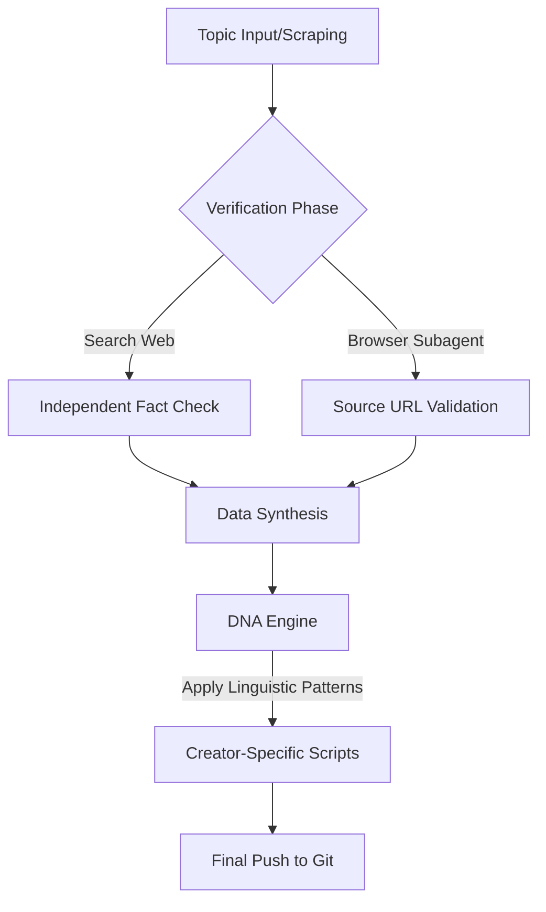

# AI Short Script Generator 🎬🤖

An automated infrastructure for producing high-fidelity, factually airtight YouTube Shorts scripts for trending business, sports, and geopolitical topics.

## 🚀 Overview

This system synthesizes the unique linguistic "DNA" of distinct creators (e.g., Nitish Rajput, KK Create, Shivanshu Agrawal) while enforcing a strict **Zero Hallucination Protocol**. Every script is cross-verified across multiple external sources to ensure the highest data integrity.

## 🛠️ System Architecture



## 📜 Zero Hallucination Protocol

Every script generated by this system follows the **Priority 1: Link and Content Validation** rule:
- **No Blind Trust:** We do not rely solely on provided links.
- **Cross-Verification:** All claims are vetted against secondary reputable sources (LiveMint, Economic Times, etc.).
- **URL Vetting:** Slugs and metadata are checked for contradictory spoilers.
- **Reference Tables:** Every script includes a verified citation table at the end.

## 📁 Project Structure

- `/scripts`: The final generated scripts, categorized by creator.
- `/patterns`: DNA profiles and linguistic tics for each creator.
- `/strategy_data`: Raw transcript and metadata used to build DNA profiles.
- `SCRIPT_RULES.md`: The central governing rules for script generation.

## ⚡ Instructions

### 1. Topic Ingestion
Use `ingest.py` to pull fresh trending topics or transcripts.
```bash
python3 ingest.py --creator <creator_name>
```

### 2. DNA Analysis
Build or update a creator's linguistic profile.
```bash
python3 build_patterns.py --creator <creator_name>
```

### 3. Learn hook patterns (per transcript)
```bash
python3 deep_hook_learn.py Shivanshu.Agrawal
```

### 4. Script generation (Antigravity / Cursor — recommended)

Python **prepares** patterns; **you (the agent) research and write** the script.

```bash
python3 prepare.py --creator GenZway --topic "RCB 16000 crore sale"
```

Then in Antigravity: open `scripts/GenZway/*_BRIEF.md` and follow the intelligence workflow.

After writing:
```bash
python3 validate_script.py scripts/GenZway/rcb_16000_crore_sale_dna.md -c GenZway
```

See `AGENTS.md` and `.cursor/skills/viral-shorts-script/SKILL.md`.

Optional legacy API-only mode (not recommended): `python3 generate.py --auto -c ... -t ...`

## 📈 Supported Creators
- **Nitish Rajput**: Analytical, formal, academic investigative style.
- **KK Create**: Emotional grounding, conversational documentary (v2 DNA).
- **Shivanshu Agrawal**: Clean, declarative documentary style.
- **GenZway**: Aggressive corporate/GenZ Hinglish analysis.
- **OpenLetterYT**: Street-level aggressive exposé style.

---
*Maintained with ❤️ for high-octane information arbitrage.*
